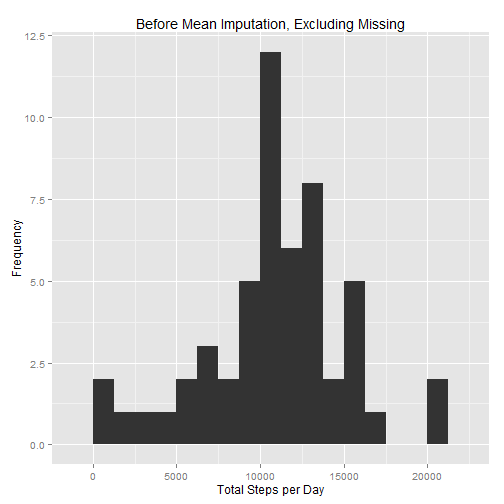
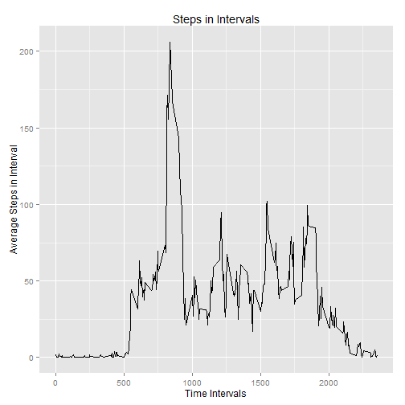
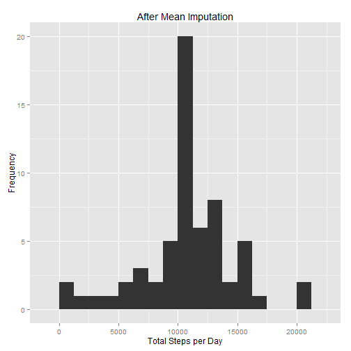
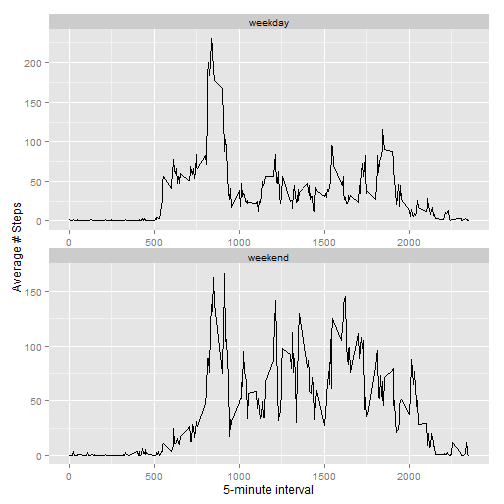

## Loading and preprocessing the data

The link for the data is provided below:
Dataset: [Activity monitoring data](https://d396qusza40orc.cloudfront.net/repdata%2Fdata%2Factivity.zip) [52K]


```r
# Read in data for analysis
        temp <- tempfile()
        fileURL <- "http://d396qusza40orc.cloudfront.net/repdata%2Fdata%2Factivity.zip"
        download.file(fileURL,destfile = temp)
        ActMonData <- read.csv2(unz(temp,"activity.csv"), header = TRUE, 
                                sep= ",", na.strings = NA)
        unlink(temp)
        rm(temp)
```

## What is mean total number of steps taken per day?

```r
# select positive steps values which is equivalent to non-NA
        monsteps <- sqldf("select date, 
                        sum(steps) as DaySteps 
                        from ActMonData 
                        where steps >= 0 
                        group by date")
# Plot Histogram of total steps per day; select reasonable bin width
        qplot(monsteps$DaySteps, geom = 'histogram',binwidth = 1250,
              main="Before Mean Imputation, Excluding Missing", 
              xlab="Total Steps per Day", ylab="Frequency")
```

 

```r
        meandaysteps <- round(mean(monsteps$DaySteps))
        mediandaysteps <- round(median(monsteps$DaySteps))
```

The **average total number of steps per day** is 10766 and the **median** is 10765 steps.

## What is the average daily activity pattern?

```r
# find average stepes per 5 min interval
        monintervals <- sqldf("select interval, 
                              avg(steps) as AvgSteps 
                              from ActMonData 
                              where steps >= 0 
                              group by interval")

# Plot time series for trend in steps as day progresses
        ggplot(data=monintervals, aes(interval,AvgSteps)
               ) + geom_line() + labs(x="Time Intervals",
                                      y="Average Steps in Interval", 
                                      title = "Steps in Intervals")
```

 

```r
# Find the interval that has the maximum average steps
        maxsteps <- sqldf("select * 
                          from monintervals  
                          where AvgSteps = (select max(AvgSteps) 
                                                from monintervals) 
                        ")
```

The interval that begins at **835** has the maximum average number of steps.

## Imputing missing values

The steps variable has **2304** missing element. An appropriate imputation for the missing values is to use the average number of steps in their respective time intervals. Since the intervals are small the imputation should not affect the stability of the data in each interval by much. Overall, if the distribution of missing values does not follow the rest of the data then the imputation could have marked effect on the results. Average steps are already available in the table `monintervals` and so it is easy to create a new variable `newSteps` which is calculated as the average steps when steps is not available in the original table. It requires merging the original data set with `monintervals`.


```r
        # Impute missing values
        missing<- sqldf("select date, ActMonData.interval, 
                        case when steps >=0 then steps 
                        else round(AvgSteps) 
                        END as newSteps 
                        
                        from ActMonData left outer join monintervals 
                        on ActMonData.interval = monintervals.interval")

        # Make New histogram and check descriptive statistics
        monsteps2 <- sqldf("select date, sum(newSteps) as DaySteps 
                          from missing 
                          group by date")
        qplot(monsteps2$DaySteps, geom = 'histogram',binwidth = 1250,
              main="After Mean Imputation", 
              xlab="Total Steps per Day", ylab="Frequency")
```

 

```r
        meandaysteps2 <- round(mean(monsteps2$DaySteps))
        mediandaysteps2 <- round(median(monsteps2$DaySteps))
```
It appears the imputation increased the frequency for values around the center of the data and so the average and median did not change very much.The new **average total number of steps per day** is 10766 and the **median** is 10762 steps.


## Are there differences in activity patterns between weekdays and weekends?

First create a new factor variable with two levels denoting weekdays and weekends to allow for a panel plot.

```r
        #Create a new factor variable in the dataset with two levels 
        #-- "weekday" and "weekend" indicating whether a given date is a 
        # weekday or weekend day.
        day <- function(date) 
        {
                day <-weekdays(date)
                if (day %in% c("Saturday", "Sunday")) { 
                        "weekend"} 
                else {
                        "weekday"
                                 }
        }
        # Create new dataset equal to original dataset but with missing data filled in.
        missing$date <- as.Date(missing$date)
        missing$day <- as.factor(sapply(missing$date, day))

        # Make a panel plot containing a time series plot for weekdays and weekends
        monintervals2 <- sqldf("select interval,
                               day, 
                               avg(newSteps) as AvgSteps 
                               from missing 
                               group by interval, day
                               ")
        ggplot(data=monintervals2, aes(interval,AvgSteps)
               ) + geom_line() + facet_wrap(~day, ncol=1, scales="free"
                                            ) + labs(x ="5-minute interval", y = "Average # Steps")
```

 

From the figure above it is clear that the weekend generally has higher average number of steps for the range of intervals in the analysis.
